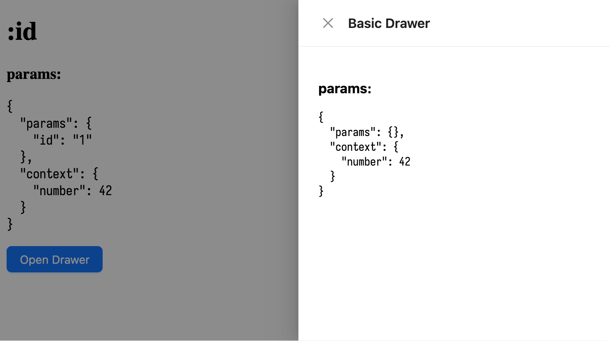

# react-router overlay repro

Reproduction repository that demonstrates how react router [`useParams`](https://reactrouter.com/api/hooks/useParams) doesn't work with [overlay-kit](https://github.com/toss/overlay-kit).

## To test

```sh
pnpm install
pnpm dev
```

then, visit http://localhost:5173/1 and open the drawer.



unlike react context value (`context`), useParams value from react-router (`params`) is not available in the drawer.

full code is contained in [src/main.tsx](src/main.tsx).
